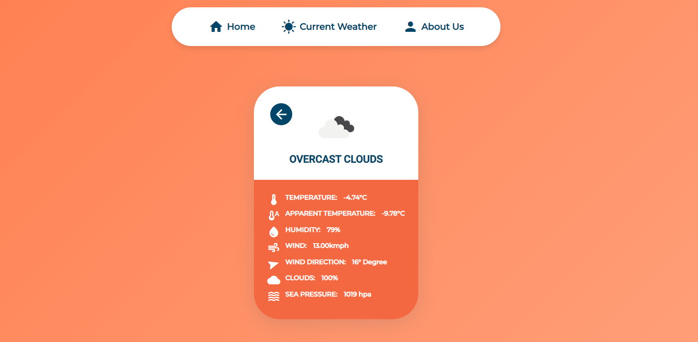

# 🌦️ Weather Masters – Simple & Dynamic Weather App

Welcome to **Weather Masters**, a sleek and user-friendly web application that provides real-time weather updates for cities worldwide. Built with modern web technologies, this app ensures a responsive and intuitive user experience across all devices.

## 🌐 Live Demo

> 🚀 https://muzamilalisuleman.github.io/Weather-Masters-Simple-Dynamic-Weather-App/

## 📸 Preview

## 🛠️ Features

- **City-Based Search Functionality**: Instantly fetch weather updates for any city.
- **Real-Time Weather Conditions**: Access temperature, humidity, and wind speed data.
- **Dynamic & Responsive UI**: Seamlessly adapts to various screen sizes for optimal viewing.
- **API Integration**: Live weather data sourced from [OpenWeatherMap](https://openweathermap.org/api).

## 🧰 Technologies Used

- **HTML5**: Structuring the web pages.
- **CSS3**: Styling and layout.
- **JavaScript (ES6)**: Handling logic and API interactions.
- **OpenWeatherMap API**: Fetching real-time weather data.

